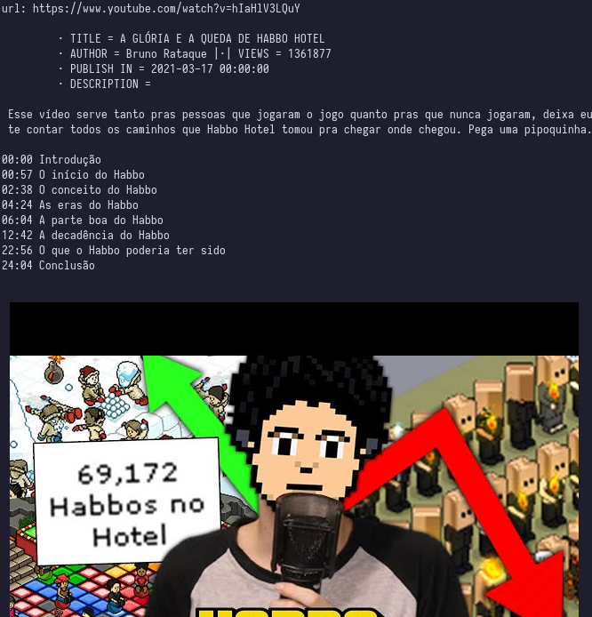

# pytube



---

## Dependencies:

* Pytube
* Requests
* Kitty Terminal (thumbnail)

### install dependencies:

`` pip install pytube requests``

## How use:

```
git clone https://github.com/SpyLima/pytube
cd pytube
python main.py #paste a youtube url
```

## To Do:

- [ ] TUI Interface
- [ ] Download in Video or Audio
- [ ] Auto-Play on mpv